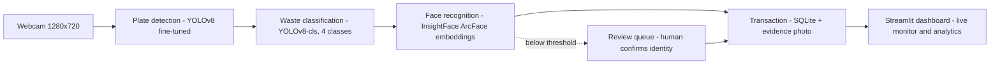

# Smart Cafeteria Waste Tracker — Pitch Narrative

> Speaker notes for the showcase pitch. Each section maps to one slide (or one
> minute of talking). Pair with `docs/DEMO_SCRIPT.md` for the live demo.

---

## 1. Hook — the problem hiding in plain sight

Every school cafeteria throws away food, every single day. The scale is bigger
than most people guess:

- The UN Environment Programme's **Food Waste Index Report** estimates that
  roughly **one fifth of all food available to consumers is wasted** — over a
  billion tonnes a year globally (UNEP Food Waste Index Report, 2024).
- The World Wildlife Fund's **Food Waste Warriors** study (2019) measured
  plate waste in 46 US schools and estimated US school cafeterias discard on
  the order of **530,000 tons of food per year — roughly 39 pounds per
  student** (WWF, *Food Waste Warriors*, 2019).
- Published plate-waste studies of school lunches repeatedly find that
  **a quarter to a third of served food ends up in the bin** — with vegetables
  wasted at the highest rates.

*(Be honest on stage: these are published estimates from other cafeterias, not
measurements from ours — that's exactly the point. Nobody measures their own
cafeteria, because measuring is tedious. That's the gap this project fills.)*

The deeper problem: cafeterias know food is wasted, but they have **zero data
on who wastes what, when, and which dishes**. You can't fix what you can't
measure — and today, measuring means a person with a clipboard weighing trays.

## 2. The idea

**One webcam at the tray-return point, and every plate becomes a data point.**

When a student returns their tray, the system:

1. detects the plate,
2. classifies how much food is left on it (EMPTY / LOW_WASTE / MEDIUM_WASTE /
   HIGH_WASTE),
3. recognizes who is returning it (from a consented, locally-stored
   enrollment),
4. writes one **transaction** to a local database with an evidence photo.

No weighing, no clipboards, no extra staff. The cafeteria gets per-person,
per-day, per-dish waste analytics for the cost of a webcam.

## 3. How it works — the pipeline



ASCII fallback if mermaid doesn't render:

```
camera ──► plate detection ──► waste classification ──► face recognition ──► transaction ──► dashboard
 (YOLOv8, fine-tuned)      (YOLOv8-cls, 4 classes)   (ArcFace embeddings)   (SQLite + photo)
                                                          │
                                                          └── low confidence ──► review queue (human) ──► transaction
```

Under the hood the engine runs an **explicit finite state machine** — every
event walks through named states you can watch live on the dashboard:

```
IDLE → PLATE_DETECTED → FOOD_ANALYSIS → WASTE_EVENT → FACE_CAPTURE
     → FACE_RECOGNITION → TRANSACTION_COMMIT (or REVIEW_REQUIRED) → COOLDOWN → IDLE
```

An empty plate takes the short path: FOOD_ANALYSIS sees no waste and returns
to IDLE — **no transaction is created for a clean plate**.

## 4. What makes this real AI (not a hardcoded demo)

- **Transfer learning on our own data.** The waste classifier is a YOLOv8
  classification model fine-tuned on photos taken in *our* cafeteria, with the
  *same camera, angle, and lighting* as deployment. The plate detector is a
  YOLOv8 detection model fine-tuned on our labeled plate photos. Neither model
  ships with the project — if you don't train them, the pipeline stays
  disabled and says so on a **System Readiness** panel. Nothing is faked.
- **ArcFace embeddings for identity.** Faces aren't matched by template images
  — each enrolled person is a 512-dimensional embedding vector (InsightFace
  `buffalo_s` pack), and recognition is cosine similarity against that vector
  with an explicit threshold (0.40 in `configs/config.yaml`).
- **Temporal voting.** Identity is decided by voting across multiple frames
  (`recognition.frames_to_vote`), not a single lucky frame — one bad frame
  can't cause a misattribution.
- **Human-in-the-loop.** When face similarity is below the threshold, the
  system doesn't guess. It files the event into a **Review Queue** with the
  evidence photo and candidate matches, and a human confirms or rejects.
  Confirmed labels become new training signal — the system gets better with
  use instead of silently failing.
- **Honesty by design.** The engine refuses to fabricate results: no trained
  models means no transactions, an optional COCO "proxy" plate mode is
  loudly labeled as a demo stand-in, and every transaction stores its real
  confidence scores and processing latency.

## 5. Live demo

See `docs/DEMO_SCRIPT.md` for the full minute-by-minute plan. The short
version, in this order:

1. Empty plate → the state machine returns to IDLE, **no transaction** —
   proving the system doesn't invent waste.
2. Plate with food + enrolled person → watch the live state transitions and
   exactly **one** transaction appear with an evidence photo.
3. Unknown person → the event lands in the **Review Queue**; we resolve it by
   hand on stage.
4. The **Training** page — how the model was trained and how the retrain loop
   works.
5. **Analytics** — the charts a cafeteria supervisor would actually use.

## 6. Limitations and ethics (be upfront — judges respect this)

- **Privacy: everything is local.** Video is processed on the machine next to
  the camera. No frames, embeddings, or names leave the device. There is no
  cloud, no external API. The database is a SQLite file on local disk.
- **Consent.** Only people who go through the explicit enrollment wizard are
  recognized. Everyone else is "Unknown" — the system stores an event photo
  for review, and an operator can reject it (which marks the transaction
  REJECTED). A real deployment needs signed consent from students/parents and
  school approval; this prototype is opt-in by construction.
- **Retention.** Evidence photos and enrollment images live in known folders
  (`data/captures`, `data/enrollment`) and can be deleted or aged out. Our
  recommendation: keep evidence photos only as long as needed for review, then
  purge.
- **Accuracy is bounded by training data.** With ~25 images per class the
  classifier works for a demo; production accuracy needs hundreds per class.
  We report real validation metrics from training, not aspirational numbers.
- **One camera is a compromise.** Plate and face share one view, so the
  camera placement matters and there are edge cases (see Q&A below). The
  architecture already supports a two-camera split.

## 7. Roadmap

- **Two-camera setup** — one camera down at the tray, one at face height. The
  code is structured for this (per-camera frame buffers, separate plate/face
  ROIs already in the config).
- **Active learning** — every Review Queue resolution is a labeled example;
  feed confirmed events back into the training set automatically so the model
  retrains itself from its own mistakes.
- **Per-meal analytics** — join waste events with the day's menu to answer
  the question the kitchen actually cares about: *which dishes get thrown
  away?* That changes purchasing and portion decisions.
- **Waste-by-weight estimation** — calibrate the visual classes against real
  scale measurements to report grams, not just categories.

## 8. Anticipated judge Q&A

**Q1. "Is this really AI, or is it hardcoded?"**
It's three real models: a fine-tuned YOLOv8 plate detector, a fine-tuned
YOLOv8 waste classifier, and InsightFace ArcFace embeddings for identity. We
can show the training runs, the version registry with real metrics, and the
System Readiness panel that disables the pipeline when models are missing —
the system literally cannot produce results without trained models.

**Q2. "What about privacy? You're doing face recognition on kids."**
All processing is local — no cloud, no network calls, no data leaves the
machine. Recognition only works for people who opted in through the enrollment
wizard; everyone else is "Unknown." A real deployment would require signed
consent and school policy approval, and we've documented retention and
deletion procedures in the operator runbook.

**Q3. "What accuracy do you get?"**
Whatever the validation split says — we report the real top-1 accuracy from
training (shown on the Training page and stored in `models/registry.json`),
measured on a held-out test split with deterministic, leak-free splitting. We
won't quote a number we didn't measure. Face recognition uses a published
architecture (ArcFace) with a tuned similarity threshold, plus a review queue
to catch the cases below threshold.

**Q4. "What if two students swap trays?"**
Then the waste is attributed to whoever returns the tray — the system
attributes *returns*, not *consumption*. That's a known limitation of any
return-point measurement. Mitigations: the evidence photo makes disputes
resolvable by a human, and aggregate analytics (per-dish, per-day) are
unaffected by occasional swaps.

**Q5. "Why not just weigh the bins?"**
Bin weighing gives one number per day for the whole cafeteria. This gives
per-plate, per-person, per-time granularity with photographic evidence — you
learn *which dishes* and *which servings* drive waste, which is what lets the
kitchen actually change something.

**Q6. "What happens when the model is wrong?"**
Two safety nets. First, confidence thresholds: low-confidence face matches go
to the Review Queue instead of being auto-committed. Second, every transaction
stores its confidence scores and evidence photo, so an operator can audit and
correct any event. Corrections are labeled data for the next training round.

**Q7. "How does it avoid double-counting the same plate?"**
The state machine enforces one transaction per event: after a commit the
pipeline enters a COOLDOWN state before it can detect a new plate, and a plate
must persist for a minimum time before it even counts as detected. You'll see
this live in the demo — one plate, one transaction.

**Q8. "How long did training take, and on what hardware?"**
Minutes, on a laptop (Apple Silicon MPS or plain CPU) — because we use
transfer learning from pretrained YOLOv8 weights rather than training from
scratch. That's the practical point: a school can build this with a laptop
and an afternoon of photo-taking.

**Q9. "Does it work in real time?"**
Yes, with engineering trade-offs we can explain: 720p capture, frame skipping
for plate detection, a reduced face-detection input size, and a dedicated face
inference thread. The dashboard shows live FPS and per-stage latency — real
measured numbers, not estimates.

**Q10. "What would it take to deploy this for real?"**
Consent process and policy sign-off; a few hundred training images per waste
class collected over normal service days; a fixed camera mount; and the
two-camera upgrade for reliable simultaneous plate+face view. The software
side — versioned models, hot-swap activation, review queue, operator runbook —
is already built.

---

## Sources

- UNEP, *Food Waste Index Report 2024* — global consumer-level food waste
  estimates.
- WWF, *Food Waste Warriors: A deep dive into food waste in US schools*
  (2019) — school plate-waste measurements and per-student estimates.
- Peer-reviewed plate-waste literature on school lunches (e.g., studies in
  the *Journal of the Academy of Nutrition and Dietetics*) consistently
  reporting 25–33% plate waste in school meal programs.

State clearly in the pitch that figures are from these published studies, and
that our own cafeteria's numbers are exactly what this system will measure.
